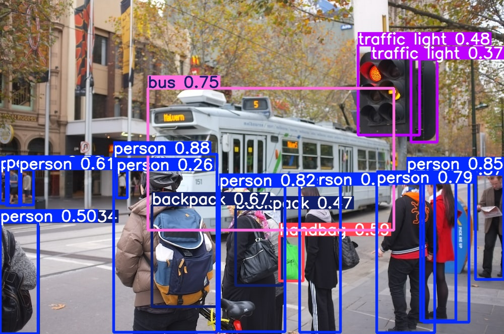

# OAIX Detection App 📷🎥

This is a Streamlit-based web application for detecting objects in images and videos using the **YOLOv11** model by [Ultralytics](https://github.com/ultralytics/ultralytics). It supports object detection, segmentation, and pose estimation using pre-trained models. The goal is to provide an educational, modular, and interactive way for developers and students to explore AI-driven computer vision.

---

## 💡 Features

- Upload or select demo images and videos
- Choose between detection, segmentation, and pose estimation
- Adjust detection confidence threshold
- Visualize results with bounding boxes or keypoints
- Fully open-source, well-documented and developer friendly

---

## 📁 Project Structure

```bash
.
├── app.py                      # Main Streamlit app script
├── images/
│   ├── image1.jpg              # Default image
│   └── detectedimage1.jpg      # Annotated default image
├── videos/
│   └── *.mp4                   # Sample videos
├── weights/
│   ├── yolo11n.pt              # Detection model
│   ├── yolo11n-seg.pt          # Segmentation model
│   └── yolo11n-pose.pt         # Pose estimation model
```

---

## ⚙️ Technologies Used

| Tool             | Description                                             |
| ---------------- | ------------------------------------------------------- |
| Streamlit        | Web framework to create Python dashboards and UI        |
| OpenCV           | Used for reading and resizing video frames              |
| PIL              | Image processing and visualization                      |
| Ultralytics YOLO | For object detection, segmentation, and pose estimation |

---

## 📌 How the Code Works (Line-by-Line Explanation)

### 1. **Imports and Setup**

```python
from ultralytics import YOLO
import streamlit as st
from pathlib import Path
from PIL import Image
import sys
import cv2
```

- Import all necessary libraries. YOLO is from the Ultralytics framework. Streamlit is for UI, OpenCV and PIL for media processing.

### 2. **Streamlit Page Configuration**

```python
st.set_page_config(page_title="OAIX", page_icon="🤖")
```

- Sets page title and favicon.

### 3. **Path Configuration**

```python
FILE = Path(__file__).resolve()
ROOT = FILE.parent
if ROOT not in sys.path:
  sys.path.append(str(ROOT))
ROOT = ROOT.relative_to(Path.cwd())
```

- Establishes working directory and ensures imports work correctly.

### 4. **Constants**

```python
IMAGE = "Image"
VIDEO = "Video"
SOURCE_LIST = [IMAGE, VIDEO]
```

- Simple flag to switch between image and video modes.

### 5. **Path to Resources**

- `IMAGES_DIR` and `VIDEOS_DIR` point to folders with demo content.
- `MODEL_DIR` points to YOLO model weights.

```python
MODEL_DIR = ROOT/'weights'
DETECTION_MODEL = MODEL_DIR/'yolo11n.pt'
SEGMENTATION_MODEL = MODEL_DIR/'yolo11n-seg.pt'
POSE_MODEL = MODEL_DIR/'yolo11n-pose.pt'
```

### 6. **User Interface Header**

```python
st.header("OAIX Detection")
```

- Adds a nice header to the main app.

### 7. **Sidebar for Model Configuration**

```python
model_type = st.sidebar.radio("Task", ["Detection", "Segmentation", "Pose Estimation"])
confidence_value = float(st.sidebar.slider("Select Model Confidence Value", 25, 100, 40)) / 100
```

- Allows user to choose model type and set detection confidence.

### 8. **Load YOLO Model**

```python
model = YOLO(model_path)
```

- Loads the selected model from local `.pt` file.

### 9. **Image Mode Logic**

- File uploader lets user choose an image.
- If no image is uploaded, use a default one.
- Runs detection and displays results using `.predict()` and `.plot()`.
- Results include bounding boxes and metadata.

### 10. **Video Mode Logic**

- User selects a video and clicks "Detect Video Objects".
- Each video frame is processed with YOLO and annotated in real-time.
- Frame-by-frame display using `cv2.VideoCapture`.

---

## 📚 Learning Outcomes

- Learn how to integrate YOLOv11 into a Streamlit app.
- Understand object detection flow for both image and video.
- Explore real-time inference concepts.
- Experiment with different model types (detection, segmentation, pose).

---

## ✅ Requirements

- Python 3.9+
- Install dependencies using:

```bash
pip install -r requirements.txt
```

---

## 🚀 How to Run

```bash
streamlit run app.py
```

---

## 📦 Model Notes

You can replace `yolo11n.pt` with your custom trained model.

---

## 🧠 About the Author

created by **Emiliano Roberti** to democratize AI-powered computer vision through practical tool.

---

## 📸 Example Outputs


